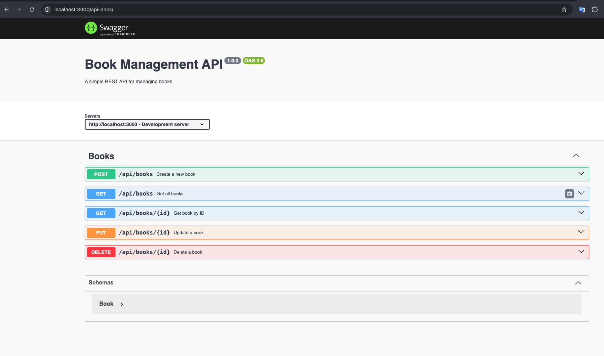

# Book Management API

A RESTful API built with Express.js and TypeScript for managing a book collection. This API provides CRUD operations for books and includes Swagger documentation.

## Getting Started

### Prerequisites

- Node.js (v14 or higher)
- npm (Node Package Manager)

### Installation

1. Clone the repository:

```bash
git clone <repository-url>
cd src/problem5
```

2. Install dependencies:

```bash
npm install
```

3. Build the server

```bash
npm run build
```

4. Start the server:

```bash
npm start
```

The server will start on `http://localhost:3000`

## API Documentation

The API documentation is available through Swagger UI at `http://localhost:3000/api-docs`

### Swagger UI Demo



### Available Endpoints

#### Books

- `GET /books` - Get all books
- `GET /books/:id` - Get a specific book by ID
- `POST /books` - Create a new book
- `PUT /books/:id` - Update a book
- `DELETE /books/:id` - Delete a book

### Request/Response Examples

#### Create a Book

```http
POST /books
Content-Type: application/json

{
  "title": "The Great Gatsby",
  "author": "F. Scott Fitzgerald",
  "publishedYear": 1925
}
```

#### Get All Books

```http
GET /books
```

## Project Structure

```
src/problem5/
├── index.ts              # Application entry point
├── database.ts           # Database configuration
├── swagger.ts           # Swagger configuration
├── routes/
│   └── bookRoutes.ts    # Book routes and controllers
├── books.db             # SQLite database file
├── package.json         # Project dependencies
└── tsconfig.json        # TypeScript configuration
```

## Technologies Used

- TypeScript
- Express.js
- SQLite3
- Swagger UI Express
- Jest (for testing)

## Error Handling

The API includes comprehensive error handling for:

- Invalid requests
- Not found resources
- Server errors

## Development

To run the application in development mode with hot reloading:

```bash
npm run dev
```

## Testing

To run tests:

```bash
npm test
```

## License

This project is licensed under the MIT License.
