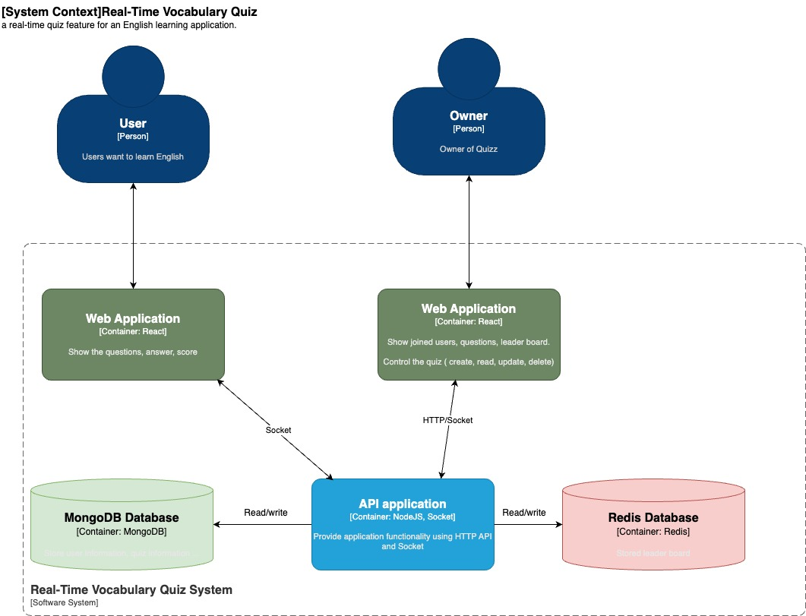
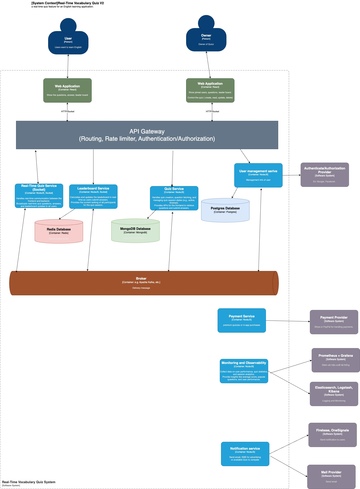
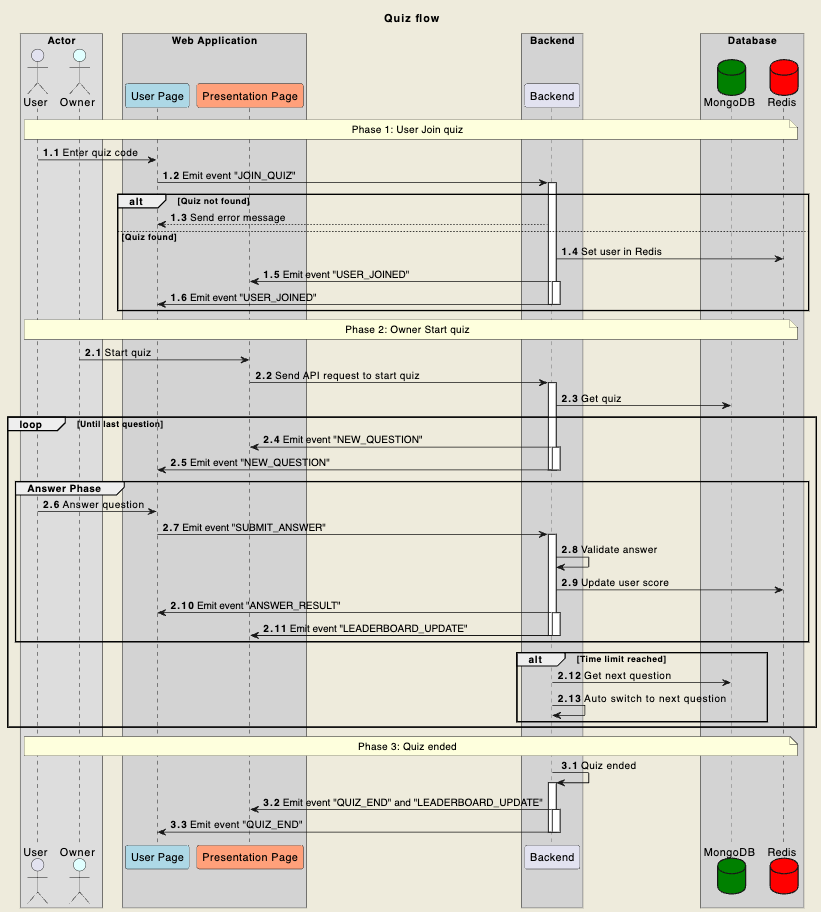

# Real-Time Vocabulary Quiz Coding Challenge

## Overview

Welcome to the Real-Time Quiz coding challenge! Your task is to create a technical solution for a real-time quiz feature for an English learning application. This feature will allow users to answer questions in real-time, compete with others, and see their scores updated live on a leaderboard.

## Table of Contents

- [Real-Time Vocabulary Quiz Coding Challenge](#real-time-vocabulary-quiz-coding-challenge)
  - [Overview](#overview)
  - [Table of Contents](#table-of-contents)
  - [Features](#features)
  - [System Design](#system-design)
    - [Architecture Overview V1](#architecture-overview-v1)
    - [Architecture Overview V2 (Upgrade version)](#architecture-overview-v2-upgrade-version)
    - [Quiz flow](#quiz-flow)
    - [](#)
  - [HTTP Endpoints](#http-endpoints)
    - [Quiz Management](#quiz-management)
      - [Create Quiz](#create-quiz)
      - [Get Quiz](#get-quiz)
      - [Start Quiz](#start-quiz)
      - [Next Question](#next-question)
  - [WebSocket Events](#websocket-events)
    - [Client -\> Server Events](#client---server-events)
      - [Join Quiz](#join-quiz)
      - [Submit Answer](#submit-answer)
    - [Server -\> Client Events](#server---client-events)
      - [Join Response](#join-response)
      - [Error Response](#error-response)
      - [New Question](#new-question)
      - [Answer Result](#answer-result)
      - [Leaderboard Update](#leaderboard-update)
      - [Quiz End](#quiz-end)
- [Database Specifications](#database-specifications)
  - [MongoDB Specifications](#mongodb-specifications)
    - [Collections](#collections)
      - [1. Quiz Collection](#1-quiz-collection)
      - [2. Question Collection](#2-question-collection)
    - [MongoDB Guidelines](#mongodb-guidelines)
  - [Redis Specifications](#redis-specifications)
    - [Data Structures](#data-structures)
      - [1. Quiz User Scores](#1-quiz-user-scores)
      - [2. Active Quiz Sessions](#2-active-quiz-sessions)
    - [Redis Guidelines](#redis-guidelines)

## Features

1. **User Participation**:

   - Users should be able to join a quiz session using a unique quiz ID.
   - The system should support multiple users joining the same quiz session simultaneously.

2. **Real-Time Score Updates**:

   - As users submit answers, their scores should be updated in real-time.
   - The scoring system must be accurate and consistent.

3. **Real-Time Leaderboard**:
   - A leaderboard should display the current standings of all participants.
   - The leaderboard should update promptly as scores change.

## System Design

[Link video demo](https://drive.google.com/drive/folders/1Gyx2JKdQ-CpcGoU7ReZRMHSgsW08urEw?usp=sharing)

### Architecture Overview V1



### Architecture Overview V2 (Upgrade version)



### Quiz flow



###

## HTTP Endpoints

### Quiz Management

#### Create Quiz

```http
POST /quiz

Request Body:
{
  "quizId": "string",
  "title": "string",
  "questions": [
    {
      "question": "string",
      "options": ["string"],
      "correctAnswer": number,  // 0-based index
      "timeLimit": number,      // seconds
      "points": number
    }
  ]
}

Response: 201
{
  "quizId": "string",
  "title": "string",
  "active": boolean,
  "currentQuestion": number
}
```

#### Get Quiz

```http
GET /quiz/:quizId

Response: 200
{
  "quizId": "string",
  "title": "string",
  "active": boolean,
  "currentQuestion": number,
  "questions": [Question]
}
```

#### Start Quiz

```http
POST /quiz/:quizId/start

Response: 200
{
  "message": "Quiz started successfully",
  "currentQuestion": {
    "id": "string",
    "text": "string",
    "options": ["string"],
    "timeLimit": number
  }
}
```

#### Next Question

```http
POST /quiz/:quizId/next

Response: 200
{
  "message": "Moving to next question",
  "currentQuestion": {
    "id": "string",
    "text": "string",
    "options": ["string"],
    "timeLimit": number
  },
  "questionNumber": number,    // 1-based index
  "totalQuestions": number
}

// When quiz ends:
{
  "message": "Quiz completed",
  "leaderboard": [
    {
      "name": "string",
      "score": number
    }
  ]
}
```

## WebSocket Events

### Client -> Server Events

#### Join Quiz

```javascript
// Send when user wants to join a quiz
{
  "type": "JOIN_QUIZ",
  "quizId": "string",
  "userName": "string"
}

// Example:
ws.send(JSON.stringify({
  type: "JOIN_QUIZ",
  quizId: "DEMO123",
  userName: "John"
}));
```

#### Submit Answer

```javascript
// Send when user submits an answer
{
  "type": "SUBMIT_ANSWER",
  "quizId": "string",
  "userName": "string",
  "answer": number,      // 0-based index of the selected option
  "questionId": "string"
}

// Example:
ws.send(JSON.stringify({
  type: "SUBMIT_ANSWER",
  quizId: "DEMO123",
  userName: "John",
  answer: 2,
  questionId: "question_id_here"
}));
```

### Server -> Client Events

#### Join Response

```javascript
// Received after JOIN_QUIZ
{
  "type": "JOINED_QUIZ",
  "userName": "string",
  "quizId": "string"
}

// Example handler:
if (data.type === "JOINED_QUIZ") {
  console.log(`${data.userName} joined quiz ${data.quizId}`);
}
```

#### Error Response

```javascript
// Received when an error occurs
{
  "type": "ERROR",
  "message": "string"
}

// Example handler:
if (data.type === "ERROR") {
  console.error(data.message);
}
```

#### New Question

```javascript
// Received when a new question starts
{
  "type": "NEW_QUESTION",
  "question": {
    "id": "string",
    "text": "string",
    "options": ["string"],
    "timeLimit": number
  }
}

// Example handler:
if (data.type === "NEW_QUESTION") {
  displayQuestion(data.question);
  startTimer(data.question.timeLimit);
}
```

#### Answer Result

```javascript
// Received after submitting an answer
{
  "type": "ANSWER_RESULT",
  "correct": boolean,
  "score": number,
  "leaderboard": [
    {
      "name": "string",
      "score": number
    }
  ]
}

// Example handler:
if (data.type === "ANSWER_RESULT") {
  showResult(data.correct);
  updateScore(data.score);
  updateLeaderboard(data.leaderboard);
}
```

#### Leaderboard Update

```javascript
// Received when leaderboard changes
{
  "type": "LEADERBOARD_UPDATE",
  "leaderboard": [
    {
      "name": "string",
      "score": number
    }
  ]
}

// Example handler:
if (data.type === "LEADERBOARD_UPDATE") {
  updateLeaderboard(data.leaderboard);
}
```

#### Quiz End

```javascript
// Received when quiz ends
{
  "type": "QUIZ_END",
  "leaderboard": [
    {
      "name": "string",
      "score": number
    }
  ]
}

// Example handler:
if (data.type === "QUIZ_END") {
  showFinalResults(data.leaderboard);
}
```

# Database Specifications

## MongoDB Specifications

### Collections

#### 1. Quiz Collection

- **Collection Name**: `quizzes`
- **Schema**:
  ```javascript
  {
    quizId: String,        // Unique identifier for the quiz
    title: String,         // Quiz title
    questions: [ObjectId], // Array of references to Question documents
    active: Boolean,       // Whether quiz is currently active
    currentQuestion: Number // Index of current question (0-based)
  }
  ```
- **Indexes**:
  - `quizId`: Unique index
- **Relationships**:
  - One-to-Many with Questions collection

#### 2. Question Collection

- **Collection Name**: `questions`
- **Schema**:
  ```javascript
  {
    question: String,      // Question text
    options: [String],     // Array of answer options
    correctAnswer: Number, // Index of correct answer (0-based)
    timeLimit: Number,     // Time limit in seconds
    points: Number        // Points awarded for correct answer
  }
  ```

### MongoDB Guidelines

1. Use mongoose middleware for data validation
2. Implement proper error handling for database operations
3. Use population for quiz-question relationships when needed
4. Maintain atomic operations for updates
5. Implement proper indexing strategy based on query patterns

## Redis Specifications

### Data Structures

#### 1. Quiz User Scores

- **Key Pattern**: `quiz:{quizId}:users`
- **Type**: Hash
- **Structure**:
  ```
  HSET quiz:{quizId}:users {userName} {score}
  ```
- **Example**:
  ```
  quiz:DEMO123:users = {
    "John": "1000",
    "Alice": "750",
    "Bob": "500"
  }
  ```

#### 2. Active Quiz Sessions

- **Key Pattern**: `quiz:{quizId}:active`
- **Type**: String
- **Structure**:
  ```
  SET quiz:{quizId}:active "true"|"false"
  ```

### Redis Guidelines

1. **Data Expiration**:

   - Set TTL for quiz sessions (e.g., 24 hours)
   - Use `EXPIRE quiz:{quizId}:users 86400`

2. **Score Updates**:

   - Use atomic operations (HINCRBY) for score updates
   - Example: `HINCRBY quiz:{quizId}:users {userName} {points}`

3. **Leaderboard Operations**:

   - Sort by score when retrieving leaderboard
   - Use HGETALL for retrieving all scores

4. **Performance Considerations**:
   - Implement batch operations where possible
   - Use pipelining for multiple operations
